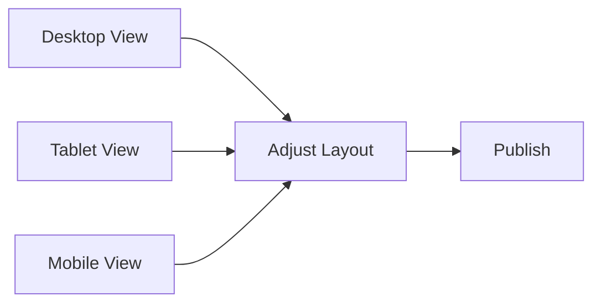

## Overview

Intelera empowers you to build stunning websites for small businesses using intuitive tools. Focus on creativity rather than code with drag-and-drop editing, ready-made templates, deep customization, and responsive previews. These features streamline your workflow from concept to launch.

<Columns cols={2}>
  <Card title="Drag-and-Drop Interface" icon="mouse-pointer" href="#drag-and-drop">
    Place elements exactly where you want them with zero coding.
  </Card>
  <Card title="Pre-built Templates" icon="layout" href="#templates">
    Start fast with designs tailored for cafes, law firms, and shops.
  </Card>
  <Card title="Branding Customization" icon="palette" href="#customization">
    Match your brand colors, fonts, and logos effortlessly.
  </Card>
  <Card title="Responsive Previews" icon="smartphone" href="#responsive">
    Test your site across devices in real time.
  </Card>
</Columns>

## Drag-and-Drop Design Interface

Build pages visually with Intelera's drag-and-drop editor. Drag blocks like headers, images, or forms from the sidebar onto your canvas. Elements snap into place with smart guides for perfect alignment.

<Steps>
  <Step title="Select a Block" icon="mouse-pointer">
    Browse the block library in the left sidebar.
  </Step>
  <Step title="Drag to Canvas" icon="move">
    Click and drag any block to your page.
  </Step>
  <Step title="Customize Inline" icon="edit-3">
    Double-click to edit text, images, or styles directly.
  </Step>
  <Step title="Preview Changes" icon="eye">
    See live updates as you work.
  </Step>
</Steps>

<Callout kind="tip">
  Use the undo button `{Ctrl+Z}` (`Cmd+Z` on Mac) to experiment freely.
</Callout>

## Pre-built Templates for Small Businesses

Jumpstart your project with templates optimized for common industries. Each includes mobile-ready layouts and SEO basics.

<Tabs>
  <Tab title="Coffee Shop" icon="coffee">
    Hero image with menu grid and contact form.

    ```
    Example structure:
    - Hero banner with shop photo
    - Services grid (coffee, pastries)
    - Reservation form
    - Footer with hours
    ```
  </Tab>
  <Tab title="Law Firm" icon="gavel">
    Professional design with testimonials and case studies.

    ```
    Key sections:
    - Practice areas accordion
    - Attorney bios
    - Free consultation CTA
    - Client reviews carousel
    ```
  </Tab>
  <Tab title="Retail Store" icon="shopping-bag">
    Product showcase with cart integration.

    ```
    Features:
    - Product catalog
    - Promotions banner
    - Customer login
    - Shipping info
    ```
  </Tab>
</Tabs>

## Customization Options for Branding

Tailor every element to your brand. Change colors with the color picker, upload logos, and select from Google Fonts.

<Expandable title="Advanced CSS Tweaks" default-open="false">
  For pixel-perfect control, add custom CSS.

  ```css
  /* Customize button hover effect */
  .custom-btn {
    background-color: #3B82F6;
    transition: all 0.3s ease;
  }

  .custom-btn:hover {
    background-color: #1D4ED8;
    transform: translateY(-2px);
  }
  ```

  Apply via the custom code panel in site settings.
</Expandable>

## Responsive Design Previews

Ensure your site looks great on all devices. Switch previews instantly without publishing.



<Tabs>
  <Tab title="Desktop" icon="monitor">
    Full-width layouts with multi-column grids.
  </Tab>
  <Tab title="Tablet" icon="tablet">
    Stacked sections for optimal readability.
  </Tab>
  <Tab title="Mobile" icon="phone">
    Touch-friendly buttons and single-column flow.
  </Tab>
</Tabs>

<Callout kind="success">
  All templates pass Google's mobile-friendly test out of the box. Test yours with the built-in validator.
</Callout>

Ready to start? Head to the [quickstart guide](/quickstart) for your first site.