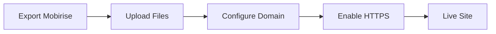

## Overview

Intelera integrates seamlessly with popular hosting providers and third-party services. You can embed widgets from tools like Google Analytics or Stripe, export your sites using Mobirise, and deploy to production with custom domains. This guide walks you through each step to get your website live quickly.

<Callout kind="tip">
  Before starting, ensure you have an Intelera project set up. See the [Quickstart](/quickstart) guide if needed.
</Callout>

## Hosting Provider Integrations

Connect Intelera to your preferred hosting platform using API keys or direct exports. Choose from popular options below.

<Columns cols={3}>
  <Card title="Netlify" icon="cloud" href="https://netlify.com" target="_blank">
    Drag-and-drop deployment with automatic previews.
  </Card>
  <Card title="Vercel" icon="zap" href="https://vercel.com" target="_blank">
    Optimized for frontend frameworks with global CDN.
  </Card>
  <Card title="AWS S3" icon="database" href="https://aws.amazon.com/s3" target="_blank">
    Scalable static hosting for high-traffic sites.
  </Card>
</Columns>

<Tabs>
  <Tab title="Netlify" icon="cloud">
    <Steps>
      <Step title="Get API Key">
        Log in to Netlify and navigate to **Site settings > General > Personal access tokens**.
      </Step>
      <Step title="Connect in Intelera">
        In your Intelera dashboard, go to **Integrations > Hosting** and enter your Netlify `{SITE_ID}` and `{API_KEY}`.
      </Step>
      <Step title="Deploy">
        ```bash
        intelera deploy --provider netlify --site your-site-name
        ```
        Your site deploys automatically.
      </Step>
    </Steps>
  </Tab>
  <Tab title="Vercel" icon="zap">
    <Steps>
      <Step title="Install CLI">
        ```bash
        npm i -g vercel
        ```
      </Step>
      <Step title="Link Project">
        ```bash
        vercel link
        ```
        Follow prompts to connect your Intelera repo.
      </Step>
      <Step title="Deploy">
        ```bash
        intelera export --vercel
        vercel --prod
        ```
      </Step>
    </Steps>
  </Tab>
</Tabs>

## Embedding Third-Party Widgets

Add interactive elements like forms or payments without custom code.

<CodeGroup tabs="Google Analytics,Stripe">
  ```html
  <!-- Google Analytics -->
  <script async src="https://www.googletagmanager.com/gtag/js?id=GA_MEASUREMENT_ID"></script>
  <script>
    window.dataLayer = window.dataLayer || [];
    function gtag(){dataLayer.push(arguments);}
    gtag('js', new Date());
    gtag('config', 'GA_MEASUREMENT_ID');
  </script>
  ```
  ```html
  <!-- Stripe Checkout -->
  <script src="https://js.stripe.com/v3/"></script>
  <form id="payment-form">
    <div id="card-element"><!-- Stripe Elements --></div>
    <button id="submit">Pay</button>
  </form>
  <script>
    const stripe = Stripe('pk_test_YOUR_PUBLISHABLE_KEY');
    // Mount Stripe Elements
  </script>
  ```
</CodeGroup>

<Steps>
  <Step title="Add Widget Code">
    Open your Mobirise project, select the block, and paste the embed code in **HTML Block**.
  </Step>
  <Step title="Replace Placeholders">
    Update `GA_MEASUREMENT_ID` or `pk_test_YOUR_PUBLISHABLE_KEY` with your real values.
  </Step>
  <Step title="Preview and Publish">
    Preview in Mobirise, then export.
  </Step>
</Steps>

<Callout kind="alert">
  Always use test keys like `pk_test_` for development to avoid real charges.
</Callout>

## Exporting with Mobirise

Mobirise simplifies exporting Intelera sites for hosting.

<Steps>
  <Step title="Open Project" icon="folder">
    Launch Mobirise and load your Intelera `.mobi` project file.
  </Step>
  <Step title="Customize" icon="settings">
    Edit blocks, themes, and add embeds.
  </Step>
  <Step title="Publish" icon="upload">
    Click **Publish** > **Local Folder** or **FTP**. Generate static HTML/CSS/JS files.
  </Step>
</Steps>

## Deployment and Domain Setup

After exporting, deploy your static files.

```bash
# Example: Deploy to any static host
scp -r dist/* user@your-server:/var/www/html/
```

For custom domains:

<Expandable title="Advanced DNS Setup" default-open="false">
  1. Point your domain A record to your host IP.
  2. Add CNAME for `www` subdomain.
  3. Enable HTTPS via host panel (e.g., Netlify auto-SSL).
</Expandable>



<Columns cols={2}>
  <Card title="Next Steps" icon="book-open" href="/quickstart">
    Return to Quickstart for more.
  </Card>
  <Card title="Help Center" icon="help-circle" href="/help-center">
    Get support.
  </Card>
</Columns>